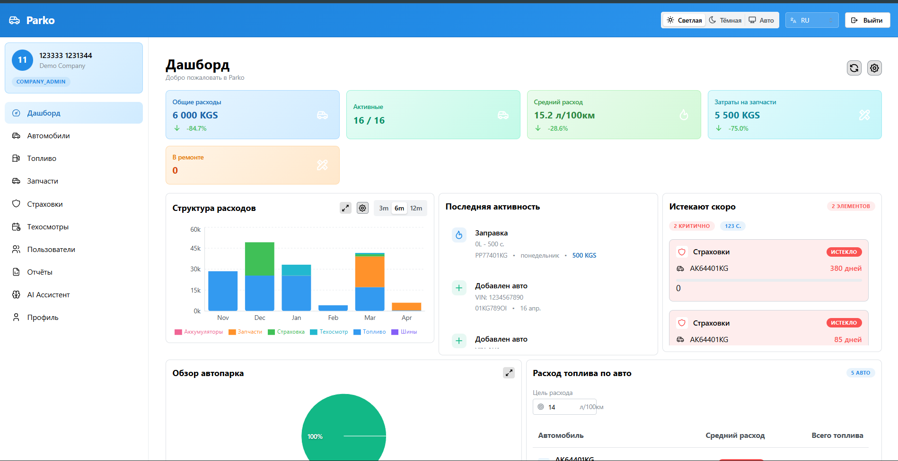
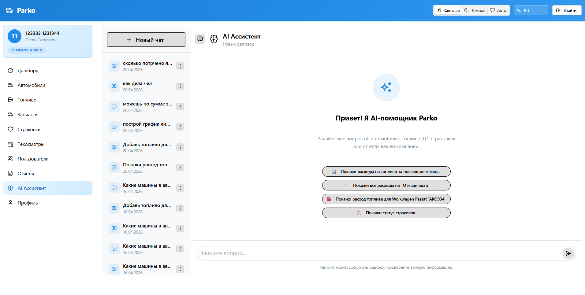
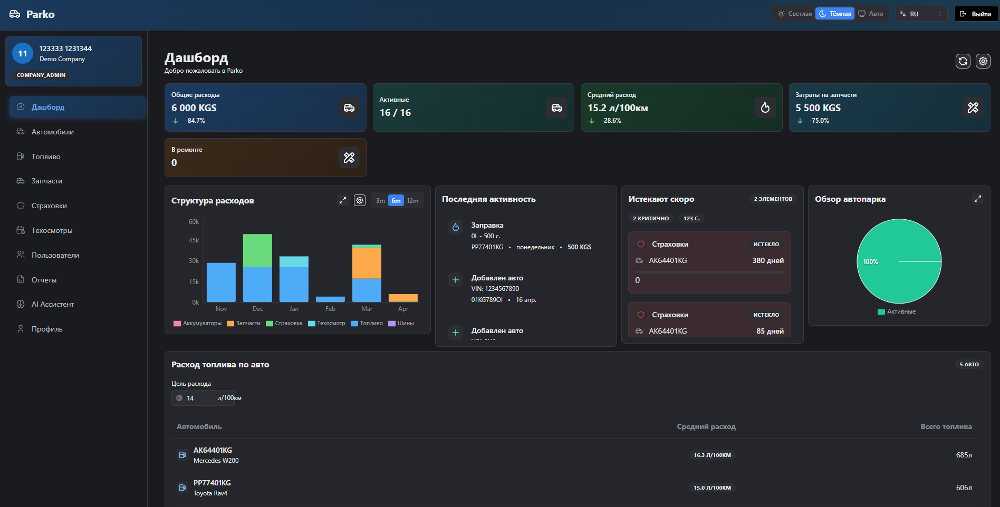
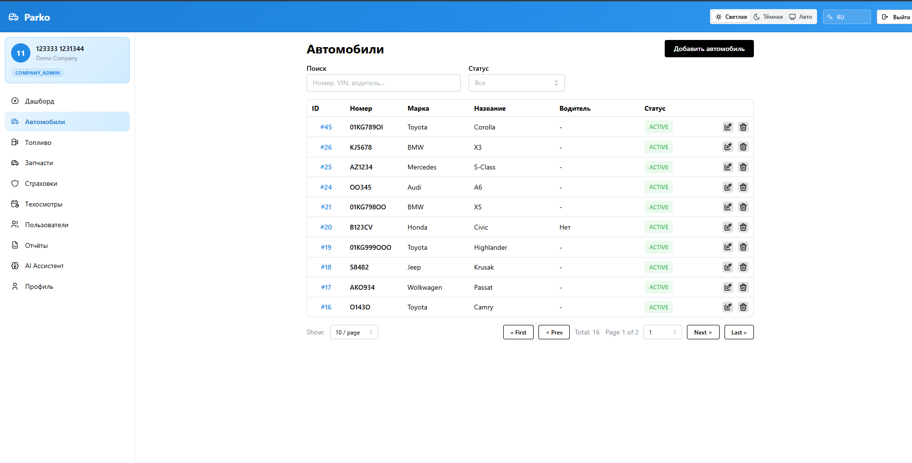
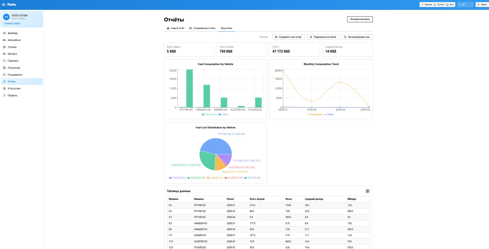

# Parko: Fleet Management SaaS
### Система управления автопарком на базе AI
**Дипломный проект**

**Стек:** Django 4.2 / React 19 / PostgreSQL / Groq AI
**Разработчик:** Жанузаков Жанат
**Группа:** IT-26, Compass College

---

## 1. Проблема и актуальность

* **Фрагментация данных:** Учёт топлива, ТО и страховок в разных таблицах/бумагах.
* **Человеческий фактор:** Ошибки при ручном вводе и сложности в генерации отчётов.
* **Отсутствие гибкости:** Трудности с масштабированием для нескольких компаний (Multi-tenancy).

**Решение Parko:** Единая облачная платформа с AI-ассистентом для автоматизации рутины и глубокой аналитикой.

---

## 2. Архитектура системы (High Level)

- **Frontend:** React 19 + TypeScript (SPA).
- **Backend:** Django REST Framework (Stateless API).
- **Auth:** JWT (Access/Refresh tokens).
- **AI Layer:** Groq API (LLaMA 3.1) для Tool Calling.
- **Tenancy:** Изоляция данных на уровне `company_id`.

---

## 3. Дизайн интерфейса (UI/UX)

**Концепция:** Чистый функциональный дизайн с поддержкой Dark Mode.

- **Библиотека:** Mantine UI v8 (современные headless компоненты).
- **Адаптивность:** Использование AppLayout для работы на desktop и планшетах.
- **Интернационализация:** Полная поддержка RU/EN/KG через `i18next`.
---

---

## 4. Методология разработки Frontend

Использована архитектура **Feature-Sliced Design (FSD)**:
- `app/`: Инициализация (providers, styles).
- `pages/`: Композиция страниц из виджетов.
- `features/`: Пользовательские сценарии (авторизация, экспорт отчётов).
- `entities/`: Бизнес-сущности (Транспорт, Топливо, Юзеры).
- `shared/`: Переиспользуемые UI-киты и API-клиенты.

---

## 5. Backend и База данных

- **Multi-tenant Logic:** Все запросы фильтруются через middleware по принадлежности к компании.
- **Performance:** Кэширование `DatabaseCache` на 5 минут для тяжелых аналитических запросов.
- **Database:** PostgreSQL с поддержкой SSL для безопасного соединения с Supabase.
- **Docs:** Автогенерация Swagger/OpenAPI через `drf-spectacular`.

---

## 6. AI-Интеграция (Smart Features)

Внедрен AI-ассистент на базе **LLaMA 3.1 (Groq)**:
- **Streaming (SSE):** Ответы приходят в реальном времени.
- **Tool Calling:** Ассистент может сам создавать записи о расходе топлива или искать поломки в истории ТО.
- **Доступ:** Ограничен ролью `COMPANY_ADMIN`.
---
## ai_chat

---

## 7. User Flow: Путь пользователя

1. **Auth:** Вход → Получение пачки JWT.
2. **Dashboard:** Обзор состояния флота (Recharts).
3. **Operations:** CRUD транспортных средств (Mantine Modals).
4. **Reporting:** Выбор фильтров → Генерация PDF/XLSX → Email-рассылка.
5. **AI Help:** Быстрая команда через чат (например: "Сколько мы потратили на топливо в марте?").

---

## 8. Итоги и Технический стек

| Слой | Технологии |
| :--- | :--- |
| **Frontend** | React 19, Vite, TanStack Query |
| **Backend** | Python 3.11, Django, DRF |
| **DevOps** | Docker, Railway/Render |
| **Tools** | Axios, Dayjs, I18next, Recharts |

**Результат:** Масштабируемая SaaS-платформа, готовая к эксплуатации.

---

# Основные экраны

## **Дэшборд (Светлая тема)**

---

## **Дэшборд (Темная тема)**

---

## **Таблицы с данными**

---

## **Интерфейс ИИ-чата**

---

## **Пример отчёта (PDF/XLSX)**

---

# Спасибо за внимание!
**Вопросы?**